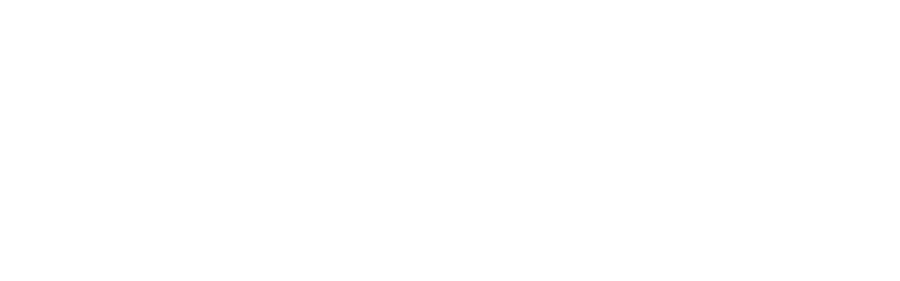

<!--
# SPDX-License-Identifier: AGPL-3.0-or-later
# OCM Test Suite: interoperability testing and evidence pipeline
# Copyright (C) 2026 Mahdi Baghbani <mahdi-baghbani@azadehafzar.io>
#-->

# Funding

The OCM Test Suite is built and maintained by Mahdi Baghbani as part of ongoing
work on Open Cloud Mesh (OCM). Turning interoperability from a claim into
reviewable evidence, across real platforms and many versions, takes sustained
time. That time is only possible because a few organizations chose to put real
money into open source infrastructure, and I am grateful to them.

## NLnet

NLnet backed this work through the NGI0 Core Fund, a fund established by NLnet
with financial support from the European Commission's Next Generation Internet
programme, under the aegis of DG Communications Networks, Content and Technology
under grant agreement No 101092990.

  
  &nbsp;&nbsp;&nbsp;
  

- Project page: <https://nlnet.nl/project/OpenCloudMesh/>
- NGI0 Core Fund: <https://www.nlnet.nl/core>
- Grant agreement 101092990: <https://cordis.europa.eu/project/id/101092990>
- NLnet: <https://nlnet.nl/>
- Next Generation Internet: <https://ngi.eu/>

## Sovereign Tech Agency

The Sovereign Tech Agency backs this work through the Sovereign Tech Fund, and
that support is a big part of what keeps the interoperability testing and the
public Observatory moving.

  
  &nbsp;&nbsp;&nbsp;
  

- Project page: <https://www.sovereign.tech/tech/open-cloud-mesh>
- Sovereign Tech Fund: <https://www.sovereign.tech/programs/fund>
- Sovereign Tech Agency: <https://www.sovereign.tech/>

## The wider project

For the bigger picture of Open Cloud Mesh and the protocol-level funding
credits, see the specification repository:

- <https://github.com/cs3org/OCM-API>
